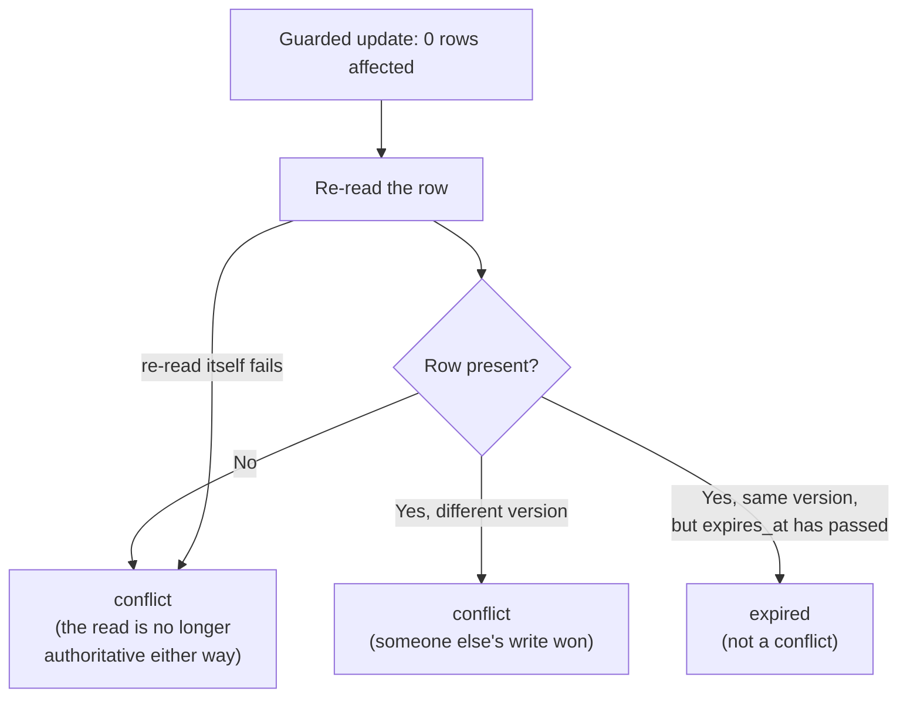
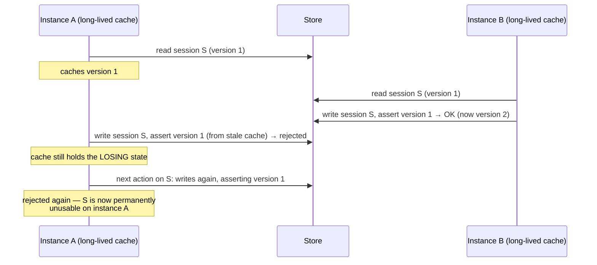
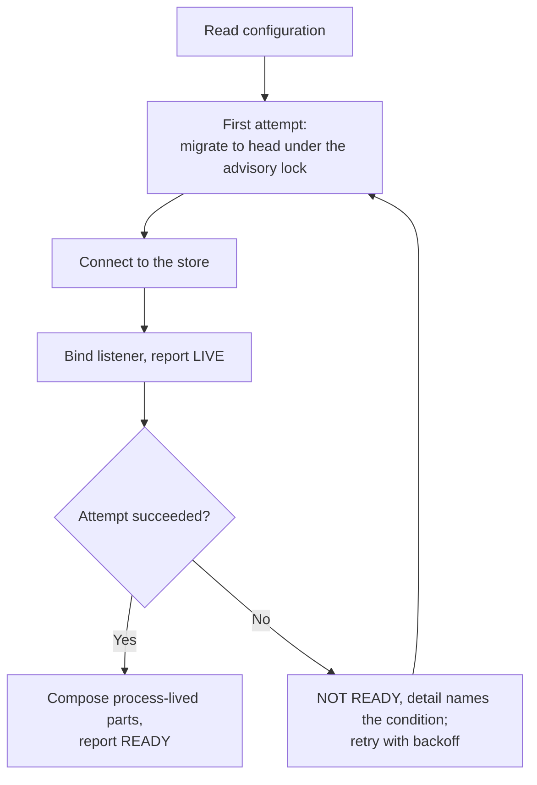

> Generated from `design/` by `/make-human-docs`. Do not edit by hand — edit the
> design docs and regenerate. `/reconcile` reports when this has gone stale.

# Durable sessions

`workloads/game-service/` can now run against a real PostgreSQL database instead of holding every
session in an in-process `Map`. Restarting or scaling to a second instance no longer loses state,
and two callers racing to update the same session no longer silently overwrite each other — exactly
one write lands, and the other gets an explicit, distinguishable rejection.

This page covers what changed to make that true, how to work with it, and what will surprise you.
It assumes you already know the wire — the operation table, the two surfaces, the byte-identity
proof — from G1; this is additive to that, not a replacement for it.

## The two storage configurations

The workload runs in one of two configurations, chosen by `WorkloadConfiguration.storage`:

- **`in-memory`** — G1's original single long-lived session layer. It still exists, it is still
  the fixture the byte-identity replay proves against, and it is **not a supported deployment
  shape**. It queues concurrent same-session requests and applies both, which is exactly the
  silent-overwrite behaviour durable mode exists to remove. Nothing outside the replay should be
  built or demonstrated against it.
- **`durable`** — a real PostgreSQL store, one schema, four tables, reachable by every instance
  you run. This is what the rest of this page is about.

`Dispatch` is shared by both and carries no branch on which one is active — it always asks a
`LifecycleProbe` for a classification, and the in-memory configuration's probe simply answers
"absent" for every id, so `unknown_session` / `unknown_save` pass straight through.

## The schema, and who owns each column

Every table splits its columns into two owners, and the split is absolute: **a column the engine
puts on its record is stored verbatim and handed back unchanged; a column the host needs is the
store's own, and the engine never sees it.**

- **`session`** — one row per session. The engine's fields (`session_id`, `blob`, `audience`,
  `attempt_counter`, timestamps, `profile_id`) round-trip byte for byte. The host adds `tenant_id`,
  `version` (the optimistic lock — see below), `engine_version`, and `expires_at`.
- **`save`** — one row per save. Saves are insert-only (`saveGame` mints a fresh id every call), so
  there is no `version` column — an optimistic lock would have nothing to guard. A second `put` for
  the same id is still an upsert, and every host column is recomputed on it.
- **`profile`** and **`profile_achievement`** — a profile's achievements are stored as individual
  rows and merged by set union (`insert … on conflict do nothing`), not as a blob that gets
  replaced wholesale. That makes the merge conflict-free: two instances awarding two different
  achievements to one profile at the same moment both land, with no lock needed. Neither table has
  an `expires_at`; they are not swept, and they grow for the life of the deployment until an
  account surface exists to own them.

Two things about the schema are easy to trip over:

- **`blob` is `text`, never `json`/`jsonb`.** `jsonb` reorders object members and renormalises
  numbers on the way in, so a blob that round-tripped through it would not be the same bytes the
  engine wrote. The column is deliberately opaque to the database.
- **Every table carries a `tenant_id`, and it is part of the primary key — but there is only one
  tenant.** The store supplies a single implicit constant on every statement. Nothing resolves a
  tenant from a request, nothing varies by it, and no caller-visible behaviour depends on it. The
  column exists now because adding it to a schema's *keys* later is a correctness migration on
  every table at once; adding it as an unused column would have been cheap either way.

Exact column types, indexes, and the migration rules that govern every schema change after the
first are in
[`design/20-contract.md`](https://github.com/The-Running-Dev/SubZeroDev.Platform/blob/main/design/20-contract.md#persisted-schemas).

## How a write is guarded

Every accepted write to a session goes through a compare-and-swap on the host-owned `version`
column, run as a single guarded `update`:

```
update … set …, version = version + 1, expires_at = now() + ttl
where tenant_id = … and session_id = … and version = <the value this request read>
  and expires_at > now()
```

If it affects one row, the write landed and the caller's in-memory read-version map advances. If it
affects **zero rows**, the adapter re-reads the row and classifies what happened — it never assumes
the reason:



The `expires_at > now()` half of the guard is not decoration: without it, a request that read a
live row microseconds before its TTL elapsed would extend that session by a full TTL while another
instance was already answering `session_expired` for it.

A **conflict** becomes a branded throw the engine's `writeSession` recognises (this is G2's one
change inside the engine itself) and turns into `concurrent_modification`, which Dispatch maps to
**`409`**. That is a different answer from **`storage_failure`** → **`503`**, which is what an
ordinary connection failure still produces — the caller can tell "re-read and decide" apart from
"the store didn't answer" for the first time.

There is no merging. The loser's write is discarded in full; a rejected caller re-reads and
resubmits as a new action, and nothing retries automatically — not on a conflict, not on
`storage_failure`, anywhere in the stack. A retried `submitAction` is a second action against state
that has moved, and the two are never combined.

This is optimistic, not pessimistic, locking: no database transaction spans the read, the engine's
own processing, and the write. A pessimistic lock (`select … for update`) would make both racing
callers eventually succeed in turn, which fails the actual requirement — one success and one
*explicit* rejection — and would hold a connection open across computation the database doesn't
control.

**The database connection must be at `read committed`.** At a stricter isolation level the losing
statement raises a serialization error instead of reporting zero affected rows, which the adapter
would have to route to `storage_failure` — every conflict would look like an outage. The store
asserts `read committed` on connect and refuses to become ready against anything else, naming the
level it found rather than reporting a generic "store unreachable".

## Why the session layer is composed fresh per request

This is the part most likely to surprise someone porting intuition from G1: **in durable mode,
nothing about a session is cached across requests.** Every `getSession` reaches the database. The
engine's own session cache and per-session queue (`sessionLocks`) still exist, but they live inside
an object built at the start of one request and thrown away at the end of it.

That is a deliberate fix for a real bug, not an oversight. A single long-lived cache per instance —
the "obvious" implementation — makes the guarded write pointless:



A cache invalidated only on write failure fixes the "permanently wedged" half but not the other
half: a plain read (`getScene`, `resumeSession`, …) on the stale instance would keep serving a
superseded scene forever, with no write and nothing to detect it. Composing the session layer fresh
per request removes the cache entirely from anywhere it could go stale — every read reaches the
store, so the guarded write is the only place concurrency is resolved, which is what makes it
provable at all. The cost is that same-session requests on a *single* instance are no longer queued
and applied in order the way G1 did — two concurrent actions against one session now produce one
`200` and one `409` even with only one instance running. That is intentional: it is already what
happens with two instances, and a deployment whose semantics changed when it scaled would be worse.

**Per request** does not mean *everything* is rebuilt per request. The connection pool, the schema,
the profile store, the lifecycle probe and the serialization handle are all process-lived; it is
the session layer, and the read-version map it consults, that are constructed empty for every
request and discarded with it.

## What a caller sees

| Situation | Code | Status | Caller does |
|---|---|---|---|
| Someone else's write won the race | `concurrent_modification` | `409` | Re-read, then decide. Never resubmit blind. |
| The store didn't answer (unreachable, pool exhausted, a driver error) | `storage_failure` | `503` | Ordinary retry-later handling. |
| The session/save existed and its idle TTL or absolute TTL has elapsed, and the row is still retained | `session_expired` / `save_expired` | `404` | Start a new session, or load a save. |
| The id never existed, or was swept past the retention horizon | the engine's own `unknown_session` / `unknown_save` | `404` | Same as above — the wire cannot always tell the two `404`s apart once a row is gone for good. |
| A stored row exists but its columns can't be read back into the shape the store expects (corruption, or a column widened out from under its declared type) | `storage_failure` | `503` | Not caller-fixable, and **not distinguishable on the wire from an ordinary store outage** — the read ports return a record or throw, and the engine converts every throw into `storage_failure`. An operator separates the two afterwards from the store's own log line, which names the offending column, and from the row's `engine_version`. |
| A profile is missing, unreadable, or the store is degraded while reading one | `profile_missing` / `profile_corrupt` warning | `200` | The game action still succeeds; achievements read as empty. This self-corrects, because the achievement merge is a set union. |
| A profile write failed | `profile_write_failed` warning | `200` | The already-committed session write is **not** rolled back. |

The full error-variant tables, with every retry rule, live in
[`design/20-contract.md`](https://github.com/The-Running-Dev/SubZeroDev.Platform/blob/main/design/20-contract.md#error-semantics).

## Session and save lifetimes

Sessions carry an idle TTL (30 days by default); saves carry an absolute TTL from creation (365
days), since a save is immutable and worth more caution than a resumable session. Both are plain
configuration, along with the retention horizon — but those are production defaults rather than
knobs the proofs turn: expiry is proved by seeding a row's `expires_at` into the past directly, not
by shortening a TTL and waiting, so every proof runs at the real bounds.

A row past its TTL is treated as **not found** on every read, immediately — that check doesn't wait
for any background process. A separate **sweep**, running on a timer in every instance, hard-deletes
rows only once they are past a much larger **retention horizon** (30 days past expiry, by default).
The sweep is two plain `delete`s in one transaction and is idempotent, so two instances sweeping at
once need no coordination between them.

The gap between "expired" and "actually deleted" exists on purpose: it's what lets the wire answer
"this session existed and is gone" (`session_expired`, 404) instead of "no idea" (`unknown_session`,
also 404 but a different code) for as long as the retained row survives. Past the retention horizon,
the answer honestly degrades to the second one — the row is gone, and nothing distinguishes an
expired id from one that never existed.

One TTL nuance worth knowing: **only an accepted write refreshes a session's clock.** Reading a
session — `getScene`, `getView`, `resumeSession`, and so on — does not extend `expires_at`. A
session that's being read continuously but never written to will still expire on schedule.

The sweep never touches `profile` or `profile_achievement` rows — those have no `expires_at` at
all, and grow for as long as the deployment runs.

## Running it

**Provisioning.** A compose file under `workloads/game-service/` brings up PostgreSQL, pinned to
`UTF8` encoding with an explicit initdb locale (an unpinned locale can silently reorder the
determinism dump's `text` sort). It provisions the database and nothing else — it does not start,
supervise, or describe a workload deployment.

**Starting up.** On boot the workload reads its configuration, then makes a first startup attempt:
it runs migrations to head under the migration tool's own advisory lock (safe for two instances
starting together), then connects to the store. **The listener binds and the process reports live
once that first attempt settles** — not before it, and not only once it succeeds. If the attempt
failed, the process is bound, live, and **not ready**, and it keeps retrying with backoff in the
background; every request in the meantime fails with `storage_failure`, which is the same answer a
connected-but-degraded store gives, so there is no separate "not started yet" behaviour for a caller
to learn.



**The cost of that ordering, stated plainly:** because the migration runs *inside* the attempt the
bind waits on, a first start against a lock another instance is holding can leave the listener
unbound for tens of seconds — and an unbound listener answers nothing at all, not even a `503`. The
alternative (bind first, migrate in the background) was rejected because a process bound before its
schema is known to exist can only answer the same `503` it would give unbound, minus an operator's
ability to tell a slow start from a refused one. What this makes load-bearing is the migration
lock's own timeout: it has to stay short enough that a contended start is a slow start rather than
an outage.

**Readiness vs. liveness.** `readiness()` evaluates the store on every single call — it is not a
cached startup result — so it can flap if the store blips. That's deliberate: a readiness check that
only ever remembered the outcome of startup would keep reporting healthy through exactly the outage
it exists to catch. `liveness()` never consults the store at all. The edge's own readiness probe was
changed to match — it checks the workload's *readiness* endpoint rather than its liveness endpoint,
because with a durable store a workload can be alive and unable to serve anything.

While the workload is not ready, the readiness result carries a `detail` string naming **which**
condition is holding it back, so an operator can tell a condition that waiting will clear from one
that never will:

| `detail` names | What it means |
|---|---|
| a migration lock timeout | Another instance is holding the advisory lock. Waiting may clear it. |
| a failed migration, by name | That migration errored. Retried with backoff, but it will keep failing until fixed. |
| the store unreachable | Ordinary connectivity. Waiting may clear it. |
| the store's isolation level, when it is not `read committed` | Misconfiguration. **No amount of waiting clears this** — it is called out by name precisely so it does not read like an outage. |
| the connection pool exhausted | The pool has no connection to give. |

A migration that is still *running* is deliberately not among them, and cannot be: the listener
binds only once that first attempt settles, and the migration runs inside it, so no probe is ever
served while a migration is in flight.

**Two instances, one store.** The proof harness that spawns two workload processes against one
schema is also the documented, runnable entry point for standing up two instances yourself — the
compose file deliberately doesn't do this part, so there is exactly one artifact that both starts
two instances and proves the contention behaviour, rather than a demo path and a tested path
drifting apart. See
[`design/20-contract.md`](https://github.com/The-Running-Dev/SubZeroDev.Platform/blob/main/design/20-contract.md#proof-harness--the-durable-replay-the-two-instances-the-conformance-suite)
for `spawnInstances`' signature, and the workload's own README for the exact command.

**Migrating.** Migrations run as one transaction per run, under the migration tool's advisory lock,
so two instances starting concurrently never both apply the same migration and no partial schema is
ever left behind. The one rule that matters for writing a new migration: **it must be backward
compatible with whatever code is currently deployed.** Two instances share one store and are never
restarted atomically, so a rolling deploy runs old and new code against the same schema for a
window. Add columns with defaults; never rename or narrow a column in one step. The same two-step
applies to `profile.format_version` — bump the format only after every instance can already read it.

## What this deliberately does not do

These are binding scope limits, not gaps to be filled incidentally:

- **No authentication, no ownership, no accounts.** Nothing here checks who is asking. That's a
  later effort's job, layered on top through a decorator seam this work leaves in place (see
  below) — not something to bolt on here.
- **Not reachable beyond trusted-local.** No public exposure, no TLS, no cross-origin access. Don't
  design around this becoming public without that decision being made explicitly elsewhere.
- **No raw game state on the wire, ever.** The store can read every blob in the system — that's
  exactly why no route or MCP tool is allowed to import it, checked structurally rather than by
  convention. A debugging endpoint that returns a stored blob is permanently out of scope, not
  merely unbuilt.
- **No tenancy behaviour.** The `tenant_id` column exists in every key from the first migration, but
  no request resolves or carries a tenant and no behaviour varies by one. Shipping the fixed schema
  shape is not shipping tenancy.
- **No eleventh game operation.** A hosting need the store does not meet is a new store operation
  *in the engine*, never transport-side logic. The account-shaped operations a hosted service will
  eventually want (`list_saves`, `delete_account`) belong to a separate account surface, and stay
  out.
- **No performance tuning.** No connection-pool sizing, no latency target, no benchmark presented as
  a result. This work answers whether a write is correct under contention, not how many fit in a
  second.
- **One store implementation behind the engine's ports.** The workload's own database client and
  migrations live entirely inside `workloads/game-service/` — no shared persistence package is
  involved, and none gains a consumer from this.

## The seam left for later work

Every one of the three storage ports — `SessionPersistence`, `ProfileStore`, and the
`LifecycleProbe` used internally for expiry classification — is composed through a single decorator
seam, `composeStorageSeam`, taking all three as one value rather than three parameters. That is what
makes a future authorization layer's coverage checkable: a port added to the seam later is a compile
error at every decorator, rather than a port that quietly goes undecorated. The lifecycle probe is
the one that matters most here, since it can answer whether *any* id is live, expired, or absent.

Nothing decorates them today; the identity decorator is the only one that runs. Three things about
the seam are worth knowing before writing a decorator against it:

- **It guarantees coverage of all three ports, not that all three live ports meet in one grouping.**
  The in-memory configuration composes once, with all three live. The durable configuration composes
  twice — once process-lived to obtain the lifecycle probe, once per request to obtain the
  persistence and profile ports — because the probe must not be rebuilt per request while the
  session persistence must be.
- **A decorator therefore runs more than once per process, and sees placeholder members in some of
  those runs.** In the process-lived composition the persistence and profile members are the
  unavailable placeholders; in the per-request composition the lifecycle member's result is
  discarded.
- **It may carry no state between applications**, for exactly that reason.

## Where to look next

- [`design/20-contract.md`](https://github.com/The-Running-Dev/SubZeroDev.Platform/blob/main/design/20-contract.md) —
  exact TypeScript/C# signatures, the full schema, every error variant, and the numbered invariants.
- [`design/10-design.md`](https://github.com/The-Running-Dev/SubZeroDev.Platform/blob/main/design/10-design.md) —
  the reasoning behind the choices above, the rejected alternatives, and the open questions still
  waiting on a decision.
- [Engine Hosting Contract](engine-hosting-contract.md) — the ownership split between engine and
  host that the schema's column-owner rule is a direct application of.
