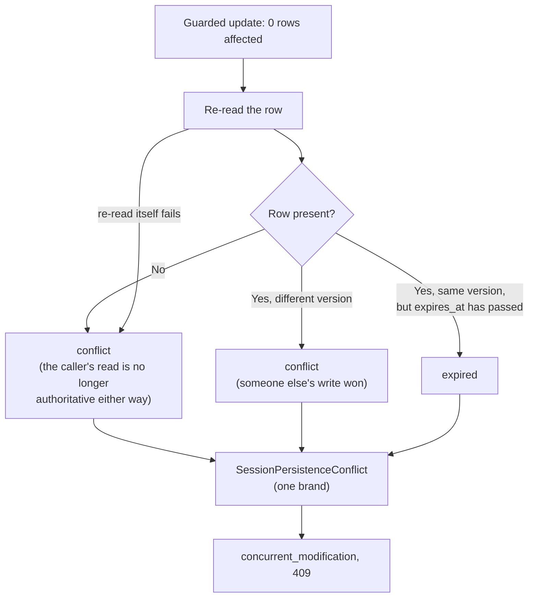
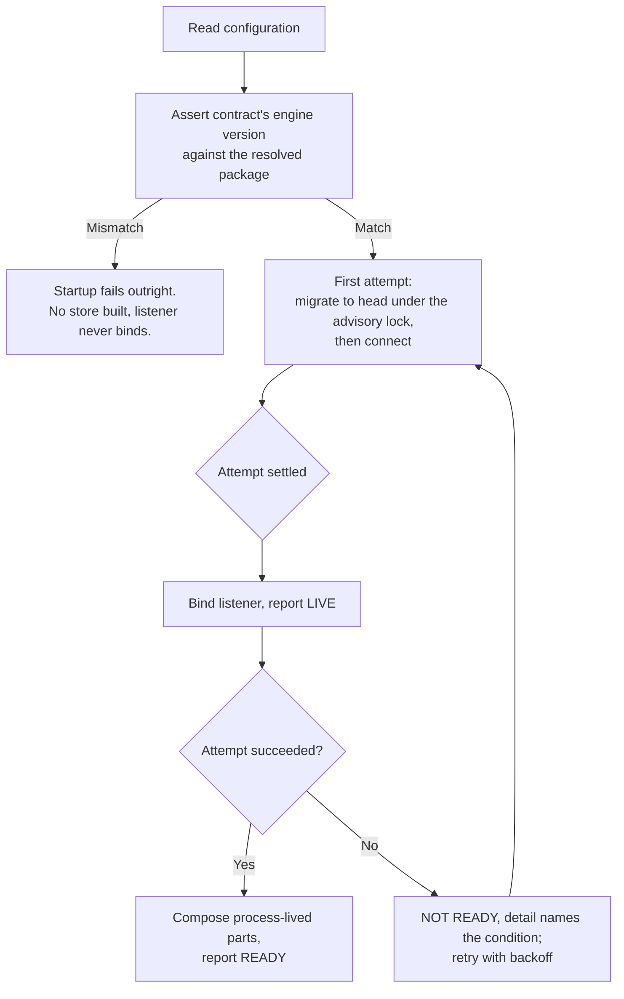

> Generated from `design/` by `/make-human-docs`. Do not edit by hand — edit the
> design docs and regenerate. `/reconcile` reports when this has gone stale.

# Durable sessions

G1 held every session in an in-process `Map`: fast, and gone on restart. G2 gives
`workloads/game-service/` a real PostgreSQL store, so a session survives a restart and a
second instance can serve it. That second instance is the whole point: two callers racing to
update the same session no longer silently overwrite each other. Exactly one write lands, and
the loser gets an explicit, distinguishable rejection instead of a state the engine never
produced.

This page assumes you already know the wire — the operation table, the two surfaces, the
byte-identity proof — from G1. It covers what changed to make durability true, how to work
with it, and what will surprise you.

## The two storage configurations

The workload runs in one of two configurations, chosen by `WorkloadConfiguration.storage`:

- **`in-memory`** — G1's original single long-lived session layer. It still exists and is
  still the fixture the byte-identity replay proves against, but it is **not a supported
  deployment shape**. It queues concurrent same-session requests and applies both of them,
  which is exactly the silent-overwrite behaviour durable mode exists to remove. Nothing
  outside the replay should be built or demonstrated against it.
- **`durable`** — a real PostgreSQL store, one schema, four tables, reachable by every
  instance you run. This is what the rest of this page is about.

Dispatch is shared by both configurations and carries no branch on which one is active: it
always asks a lifecycle probe for a classification, and the in-memory configuration's probe
simply answers "absent" for every id, so `unknown_session` / `unknown_save` pass straight
through unchanged.

One consequence worth knowing up front: the two configurations are **not wire-equivalent**.
Two concurrent actions against one session are queued and both applied under `in-memory`, and
produce one `200` and one `409` under `durable` — even on a single instance. That is
intentional (see *The concurrency mechanism* below), but it means nothing outside the replay
should be developed or demonstrated against the in-memory configuration.

## The schema, and who owns each column

Every table splits its columns into two owners, and the split is absolute: **a column the
engine puts on its record is stored verbatim and handed back unchanged; a column the host
needs is the store's own, and the engine never sees it.**

- **`session`** — one row per session. The engine's fields (`session_id`, `blob`, `audience`,
  `attempt_counter`, timestamps, `profile_id`) round-trip byte for byte. The host adds
  `tenant_id`, `version` (the optimistic lock — see below), `engine_version`, and
  `expires_at`.
- **`save`** — one row per save. Saves are insert-only (`saveGame` mints a fresh id every
  call), so there is no `version` column — an optimistic lock would have nothing to guard. A
  second `put` for the same id is still an upsert, and every host column is recomputed on it.
- **`profile`** and **`profile_achievement`** — a profile's achievements are stored as
  individual rows and merged by set union (`insert … on conflict do nothing`), not as a blob
  replaced wholesale. That makes the merge conflict-free: two instances awarding two different
  achievements to one profile at the same moment both land, with no lock needed. Neither table
  has an `expires_at`; they are not swept, and they grow for the life of the deployment until
  an account surface exists to own them.

`version` is a store-owned column on `session`: it starts at 1 on insert, is incremented by
exactly the statement that performs a guarded write, and is never computed, read, or supplied
by the engine — the engine's own `attempt_counter` is stored because the record carries it,
but it is not the lock and never was one.

Two things about the schema are easy to trip over:

- **`blob` is `text`, never `json`/`jsonb`.** `jsonb` reorders object members and renormalises
  numbers on the way in, so a blob that round-tripped through it would not be the same bytes
  the engine wrote. The column is deliberately opaque to the database.
- **Every table carries a `tenant_id`, and it is part of the primary key — but there is only
  one tenant.** The store supplies a single implicit constant on every statement. Nothing
  resolves a tenant from a request, nothing varies by it, and no caller-visible behaviour
  depends on it. The column exists now because adding it to a schema's *keys* later is a
  correctness migration on every table at once; adding it as an unused column would have been
  cheap either way.

Exact column types, indexes, and the migration rules that govern every schema change after the
first are in [`20-contract.md`](https://github.com/The-Running-Dev/SubZeroDev.Platform/blob/main/design/20-contract.md).

## The concurrency mechanism

### Why the session layer is composed fresh per request

The engine's own `getSession` reads an in-process cache first and only falls through to
persistence on a miss. If the workload composed one long-lived session layer per instance,
compare-and-swap would still be correct at the database — but it would be pointless above it.
Instance A caches a session at version 1; instance B wins a write and advances it to version
2; A's next write, from its stale cache, is correctly rejected — but A's cache is never
invalidated, so every subsequent write from A is rejected too, and the session becomes
permanently unusable on that instance. Worse, a plain read on A (`getScene`, `resumeSession`,
…) would keep serving the stale, superseded scene forever, with no write and nothing to detect
it.

The fix is compositional, not algorithmic: **for the durable configuration, nothing about a
session is cached across requests.** The connection pool, the schema, the profile store, the
lifecycle probe, and the serialization handle are all process-lived — but the session layer
built on top of them is constructed fresh for each inbound operation and discarded with it.
Every `getSession` reaches the database. A cache that cannot outlive one request cannot serve
a stale read and cannot carry a losing write forward, which makes the guarded write the only
concurrency mechanism in the system — and that is what makes it provable at all.

The cost: the engine's own per-session queue (`sessionLocks`) lives inside that per-request
object too, so it no longer serialises concurrent same-session requests *within one instance*.
Two concurrent actions against one session now produce one `200` and one `409` even with only
one instance running — which is exactly what already happens across two instances, so nothing
about the workload's semantics changes when it scales.

### The guarded write and its classification

Every accepted write to a session goes through a compare-and-swap on the host-owned `version`
column, run as a single guarded `update`:

```
update … set …, version = version + 1, expires_at = now() + ttl
where tenant_id = … and session_id = … and version = <the value this request read>
  and expires_at > now()
```

If it affects one row, the write landed. If it affects **zero rows**, the adapter re-reads the
row and classifies what happened — it never assumes the reason:



The `expires_at > now()` half of the guard exists so a write cannot resurrect a session the
wire has already declared gone: without it, a request that read a live row microseconds before
its TTL elapsed could extend that session by a full TTL while a concurrent read on another
instance was already answering `session_expired` for it.

**`conflict` and `expired` are three-way diagnostic, not a two-way routing decision.** Both
classifications leave the store as the same branded throw — the engine's `writeSession`
recognises the brand (this is G2's one change inside the engine itself) and turns it into a
single reason code, `concurrent_modification`, which maps to **`409`** regardless of which of
the two the adapter saw. The three-way split exists only so the store's own tests, and a log
line, can say *why* zero rows were affected — nothing on the wire ever sees it. The cost: a
caller whose write actually lost to expiry is told "your read is stale, re-read and decide"
rather than "your session expired" — and learns which it was one round trip later, when the
re-read comes back as `unknown_session` and the lifecycle probe answers `session_expired`.

That single conflict code is a different answer from **`storage_failure`** → **`503`**, which
is what an ordinary connection failure still produces. Before G2, both arrived at the client as
the same `503`; this is the first release where a caller can tell "someone else's write won,
re-read and decide" apart from "the store didn't answer, retry later."

There is no merging, and nothing retries automatically — not on a conflict, anywhere in the
stack. The loser's write is discarded in full; a rejected caller re-reads and resubmits as a
new action. This is optimistic, not pessimistic, locking: no database transaction spans the
read, the engine's own processing, and the write, so both racing callers never "succeed in
turn" the way a pessimistic lock would produce.

**The database connection must run at `read committed`.** At a stricter isolation level the
losing statement raises a serialization error instead of reporting zero affected rows, which
would have to route to `storage_failure` — every conflict would look like an outage. The store
asserts `read committed` on connect and refuses to become ready against anything else, naming
the level it found. This check re-runs fresh on every startup attempt, so it's retried on the
shared backoff loop like any other startup condition — a server or pooler misconfiguration that
gets corrected while the process is up is picked up without a restart. The accepted cost is the
opposite case: a misconfiguration nobody ever corrects keeps the process re-opening a pool at the
retry interval indefinitely.

**Saves are never contended, but their contents can still reflect an overtaken session.** A
fresh `saveId` is minted on every `saveGame` call, so no two writers ever target one save row —
there is no lock to hold because there is only ever one writer. But `saveGame` reads the
session and writes only the save; nothing guards the interval between them, so a save can
capture the session state from just before another instance's action won a race. That's not a
lost update — it's a faithful snapshot of a state the session genuinely held — but it means a
save is not a guarantee that no newer action exists.

## Startup and readiness

On boot the workload reads its configuration and **immediately asserts the contract's recorded
engine version against the resolved package's** — before anything else is built, and unchanged
from G1. A mismatch fails startup outright: no store is built and the listener never binds. It
runs first, ahead of the store attempt below, because it is the one startup condition no retry
can clear — backing off against a dependency that cannot change underneath the process would be
pointless.

Once that passes, the workload makes a **first startup attempt**: it runs migrations to head
under the migration tool's own advisory lock (safe for two instances starting together), then
connects to the store. **The listener binds and the process reports live only once that first
attempt settles — not before it, and not only once it succeeds.** If the attempt failed, the
process is bound, live, and **not ready**, and it keeps retrying with backoff in the background;
every request in the meantime fails with `storage_failure`, the same answer a
connected-but-degraded store gives, so there is no separate "not started yet" behaviour for a
caller to learn.



**The cost of that ordering, stated plainly: because migrating happens *inside* the attempt the
bind waits on, a first start against a lock another instance is holding can leave the listener
unbound for tens of seconds** — and an unbound listener answers nothing at all, not even a
`503`. The alternative — bind first, migrate in the background — was rejected because a process
bound before its schema is known to exist can only answer the same `503` it would give
unbound, minus an operator's ability to tell a slow start from a refused one. What this makes
load-bearing is the migration lock's own timeout: it has to stay short enough that a contended
start reads as a slow start rather than an outage.

**Readiness vs. liveness.** `readiness()` evaluates the store on every single call — it is not
a cached startup result — so it can flap if the store blips. That's deliberate: a readiness
check that only ever remembered the outcome of startup would keep reporting healthy through
exactly the outage it exists to catch. `liveness()` never consults the store at all.

While the workload is unhealthy, the readiness result carries a `detail` string naming **which**
condition is holding it back — but which conditions it can name depends on **when** it's unhealthy,
because the two moments can only reach different failures:

- **Before the store has ever connected**, `detail` names what startup is waiting on: a migration
  lock timeout, a named failed migration, or the store unreachable or at the wrong isolation
  level.
- **After it has connected and since degraded**, `detail` names whatever the readiness probe's own
  check just classified — an exhausted connection pool, or a failed statement. An exhausted pool
  specifically can't be a *startup* condition: at startup the pool holds no checked-out client, so a
  connect timeout there can only mean the server isn't answering, which is classified as plain
  unreachability instead.

A migration that is still *running* is deliberately never among them: the listener binds only once
the first attempt settles, and the migration runs inside that attempt, so no probe is ever served
while a migration is in flight. Exact `detail` strings live in
[`20-contract.md`](https://github.com/The-Running-Dev/SubZeroDev.Platform/blob/main/design/20-contract.md).

## The background sweep

Sessions carry an idle TTL (30 days by default); saves carry an absolute TTL from creation (365
days); rows past a **retention horizon** (30 days past expiry, by default) are hard-deleted.
These three bound a *row's life*, and the proofs don't exercise them by shortening a TTL and
waiting: expiry is proved by seeding a row's `expires_at` into the past directly, so every proof
runs at the real, production bounds — only the retention horizon is ever varied, by the sweep
proofs.

Two further values bound the *sweep's own work* rather than a row's life, and are varied far more
freely because nothing else reasons about them: a **1-hour sweep interval**, and a **5-second
statement timeout** on the sweep's own `delete`s. A sweep proof can't wait an hour for a real
tick, and one proof deliberately drives the statement timeout below a held lock to prove that
bound is actually enforced.

A row past its TTL is treated as **not found** on every read, immediately — that check doesn't
wait for any background process. The **sweep**, running on a timer in every instance, hard-deletes
rows only once they are past the retention horizon. The sweep is two plain `delete`s in one
transaction and is idempotent, so two instances sweeping at once need no coordination between
them. The retention horizon is required to exceed any request's duration by a wide margin, which
is what makes it impossible for a sweep to delete a row between a live request's read and its
write.

The gap between "expired" and "actually deleted" is what lets the wire answer "this session
existed and is gone" (`session_expired`, 404) instead of "no idea" (`unknown_session`, also 404
but a different code) for as long as the retained row survives. Past the retention horizon, the
answer honestly degrades to the second one — the row is gone, and nothing distinguishes an
expired id from one that never existed.

**Only an accepted write refreshes a session's clock.** Reading a session —`getScene`,
`getView`, `resumeSession`, and so on — does not extend `expires_at`. A session that's being
read continuously but never written to will still expire on schedule.

A failed sweep tick is caught, logged with the failing statement, and retried on the next tick;
a tick never starts while the previous one is still running. Because the work is idempotent, a
missed sweep costs only retained rows, nothing else — and because the sweep sits on neither the
serving path nor the readiness check, a run of failures is the one condition in G2 that no
probe and no request will ever surface; it is only visible in the logs. The sweep never touches
`profile` or `profile_achievement` rows — those have no `expires_at` at all, and grow for as
long as the deployment runs.

## Failure modes

| Situation | Code | Status | Notes |
|---|---|---|---|
| Store unreachable at startup | — | — | The process stays up, reports live, reports **not ready**, and retries with backoff. Every request in the meantime fails as below — there is no separate "not started" behaviour. |
| Store fails or is unreachable mid-request | `storage_failure` | `503` | An ordinary throw, never branded as a conflict. No partial state: either the guarded statement committed or it didn't. Caller retries later, not automatically. |
| A write loses the race | `concurrent_modification` | `409` | Zero rows affected, classified by re-read (see *The concurrency mechanism*). The loser leaves no trace — the engine writes the session before any achievement or save row, so a losing write can't orphan one. Caller re-reads, then decides; never resubmits blind. |
| A profile write fails | `profile_write_failed` (warning) | `200` | The already-committed session write is **not** rolled back. No retry — achievements are re-derivable on the next action because the merge is a set union. |
| A profile is missing, unreadable, or the store is degraded while reading one | `profile_missing` / `profile_corrupt` (warning) | `200` | The game action still succeeds; achievements read as empty and self-correct on the next successful action. A connectivity failure and a malformed row are indistinguishable on this path — the port has no separate error channel for them. |
| The sweep fails | — | — | Logged with the failing statement; retried on the next tick. Bounds storage, not correctness — an un-swept row still answers `expired`, which is more informative than `unknown_session`, not less. |
| Session or save has expired (row retained) | `session_expired` / `save_expired` | `404` | Distinct from the "never existed" code below. Caller starts a new session or loads a save. |
| Id never existed, or was swept past the retention horizon | the engine's own `unknown_session` / `unknown_save` | `404` | Once a row is gone for good, the wire cannot always tell this apart from an expired-and-swept id. |
| A stored row's columns don't satisfy their declared types (`RowUndeserializable`) | `storage_failure` | `503` | This is a **store-layer** failure — a SQL column mapping problem, e.g. corruption or a column widened out from under its declared type — caught before the engine ever sees the row. Not caller-fixable, and not distinguishable on the wire from an ordinary outage; an operator separates the two afterwards from the store's log line and the row's `engine_version`. |
| The stored blob itself does not deserialise | `internal_failure` | `500` | This is a distinct, **engine-layer** failure: the row's columns were fine and the store handed the engine a valid blob, but the engine's own `deserialize` throws on its contents. Store corruption or a blob written by an incompatible engine version — either way the workload does not guess. The row's `engine_version` lets an operator tell the two apart after the fact. |
| An id collides on insert | `storage_failure` | `503` | *Not* the conflict code — a primary-key collision is a storage anomaly, not a lost update. Not expected under the default profile's random ids. |
| The two instances are running different schema (or engine) versions | — | — | Not detected at runtime, by design. Safety is a rule on migrations, not a check: every migration must be backward compatible with the previously deployed code, since two instances share one store and are never restarted atomically. `engine_version` on each row records which engine wrote it, so a skew is legible afterwards rather than inferred. |

Full error-variant tables, with every retry rule, live in [`20-contract.md`](https://github.com/The-Running-Dev/SubZeroDev.Platform/blob/main/design/20-contract.md).

## The edge's readiness change

The .NET edge's readiness check now probes the workload's **readiness** endpoint rather than
its **liveness** endpoint. G1's edge asked "is the workload alive"; with a durable store a
workload can be alive and unable to serve anything, and an edge that reports ready while every
forward will `503` tells an operator less than nothing. The edge still evaluates the store on
every probe rather than caching startup's outcome, for the same reason the workload's own
readiness does — and it can flap for the same reason. Nothing else at the edge moves: no load
balancing across the two instances, no session affinity, no streaming. The two-instance
contention proof addresses the two workload instances directly, never through the edge.

## What's proven

Three kinds of proof back this feature, run in CI from a fresh clone:

- **Byte identity against the durable store.** G1's replay fixture, run against the durable
  store as well as the in-memory one, comparing the resulting blob sets byte for byte and each
  run's response transcript against the same committed golden transcript. G1's original
  in-memory replay stays in the suite and stays green.
- **Contention, asserted twice.** Two concurrent actions against one session, dispatched to a
  single instance, must produce exactly one `200` and one `409`. The same assertion is repeated
  across two real instances sharing one store. Neither alone is sufficient — the single-instance
  case might not even be reachable if the session layer weren't composed per request, and the
  multi-instance case is the shape the original failure actually describes.

  The two "instances" are genuine, separate OS processes, not two compositions sharing one
  event loop — anything less couldn't establish that the compare-and-swap survives a real
  process boundary. That has two practical consequences if you're extending this harness:
  configuration reaches each child only through environment variables (there's no other
  channel), and shutdown is a byte written to the child's stdin, never a signal — a hard kill
  would leave the child's pool connections open to race the schema drop that follows it.
- **Port conformance, against both implementations.** One set of assertions run twice — once over
  a reference target, once over the durable one — covering every port method the wire itself
  never exercises (`saves.delete`, and everything profile-related). The reference target pairs
  the workload's own map-backed `SessionPersistence` (the engine exports the port's *type* but no
  implementation of it) with the engine's own `createInMemoryProfileStore`. It answers "does the
  durable store fill the port" for six of seven methods unconditionally, and for the seventh
  (`profiles.save`) conditionally on a property asserted about the engine's own caller, since the
  durable merge is additive where the engine's in-memory one replaces.

This page doesn't cover the mechanics behind these proofs — the perturbation seams, the
per-run schema isolation — only that they exist and what they establish. Details are in
[`10-design.md`](https://github.com/The-Running-Dev/SubZeroDev.Platform/blob/main/design/10-design.md) and [`20-contract.md`](https://github.com/The-Running-Dev/SubZeroDev.Platform/blob/main/design/20-contract.md).

## Other things worth knowing

- **The two TTLs and the retention horizon are ordinary configuration**, not hardcoded — but the
  production defaults (30-day session idle TTL, 365-day save TTL, 30-day retention horizon) are
  what every proof runs against.
- **Every migration after the first must be backward compatible with whatever code is currently
  deployed.** Two instances share one store and are never restarted atomically, so a rolling
  deploy runs old and new code against the same schema for a window — add columns with
  defaults, never rename or narrow a column in one step. The same two-step applies to
  `profile.format_version`: bump the format only once every instance can already read it.
- **Nothing retries automatically, anywhere in the stack** — not on a conflict, not on a storage
  failure, not at the edge. A retried `submitAction` is a second action against state that may
  have moved, and the two are never merged.
- **The store is not reachable from either surface**, structurally rather than by convention —
  it can read every blob in the system, which is exactly what makes it the one module that
  could put engine state on the wire.

## Where to look next

- [`20-contract.md`](https://github.com/The-Running-Dev/SubZeroDev.Platform/blob/main/design/20-contract.md) — exact TypeScript/C# signatures, the full
  schema, every error variant, and the numbered invariants.
- [`10-design.md`](https://github.com/The-Running-Dev/SubZeroDev.Platform/blob/main/design/10-design.md) — the fuller account of the mechanisms summarised
  above, including the proof mechanics and the reasoning behind each choice.
- [Engine Hosting Contract](engine-hosting-contract.md) — the ownership split between engine and
  host that the schema's column-owner rule is a direct application of.
